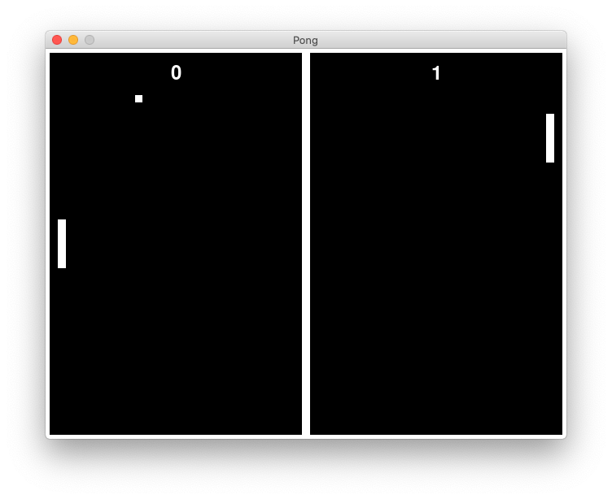

Pong
====

This is a clone of the
[classic video game Pong](https://en.wikipedia.org/wiki/Pong)
I have written to introduce the
[pygame game engine](https://pygame.org)
to students participating in the 2020
[Summer Apprenticeship Program](https://kysu.edu/academics/cafsss/cooperative-extension/4-h-youth-development/summer-apprenticeship-program/)
at [Kentucky State University](https://www.kysu.edu),
where I teach computer science and video game development.

Going through the repository step by step as described in the 
[instructions](instructions/pong.md),
this simple game demonstrates the basics of game development in general
and [Python](https://python.org) and [pygame](https://pygame.org) in particular.

A playlist with videos showing the steps is 
[available on YouTube](https://www.youtube.com/playlist?list=PLsGmgprYLmdhoWBwUB-dF-osEhzGBhvS8).

Enjoy!
