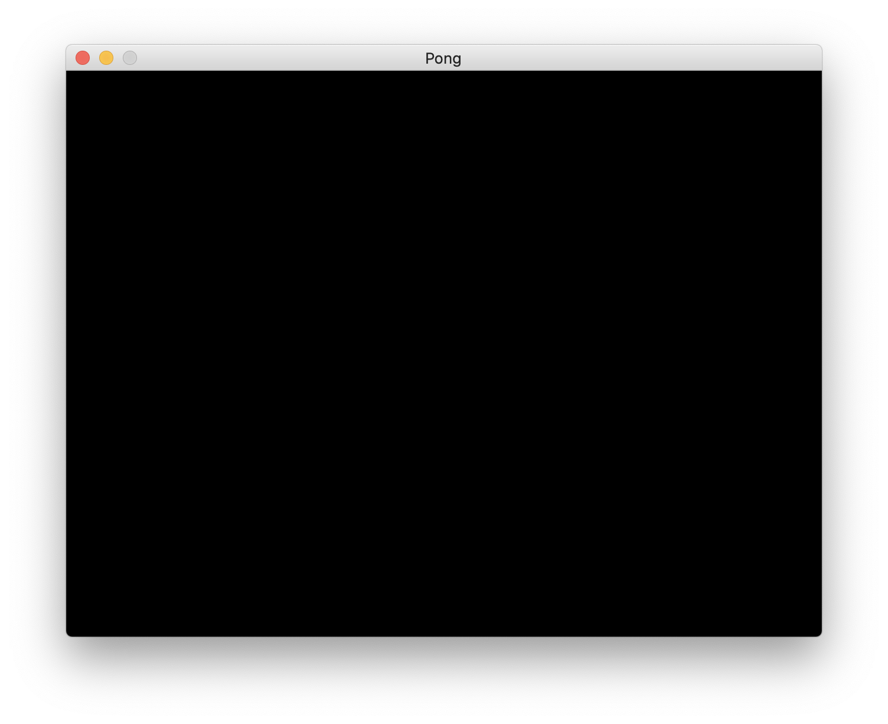
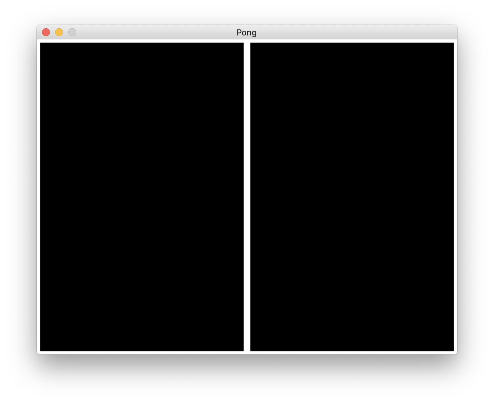
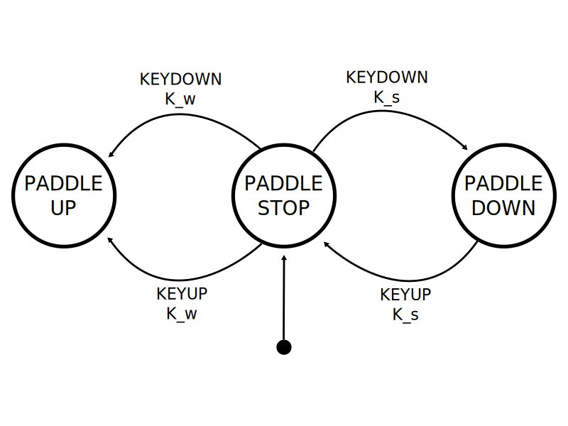
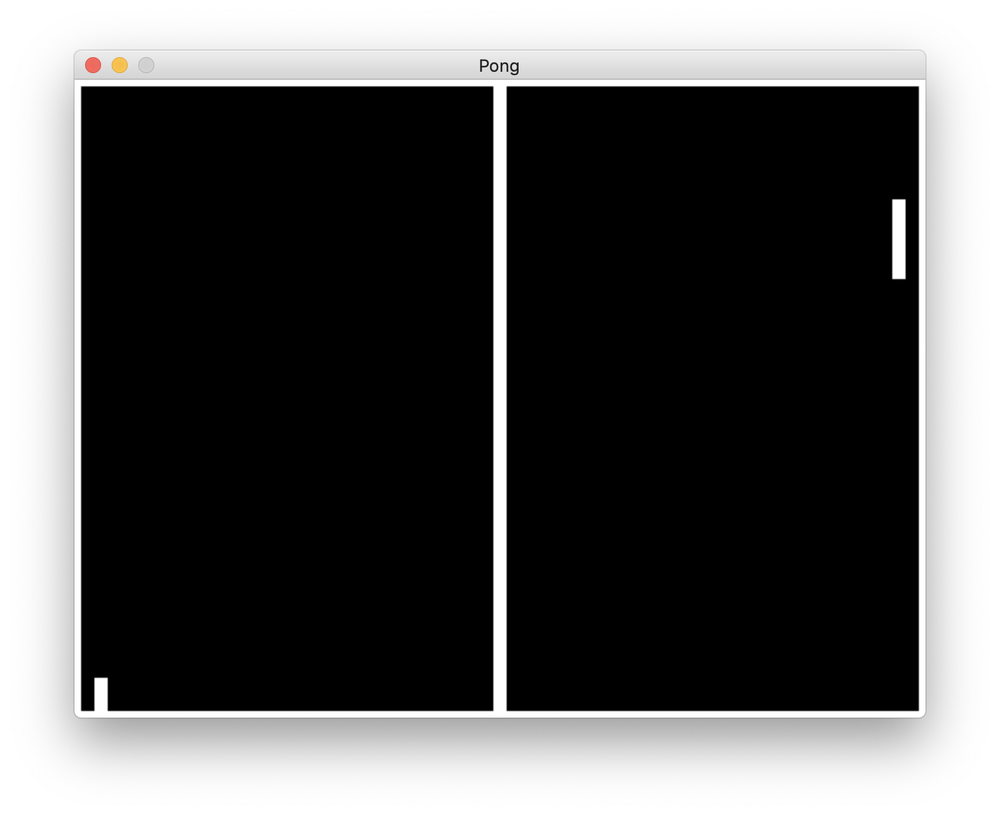
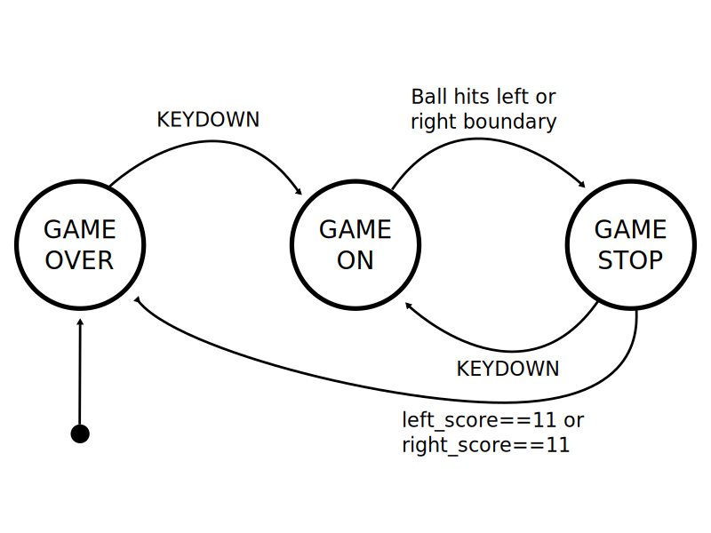
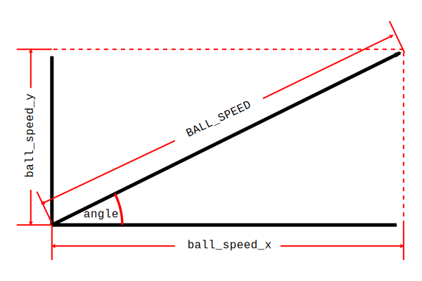
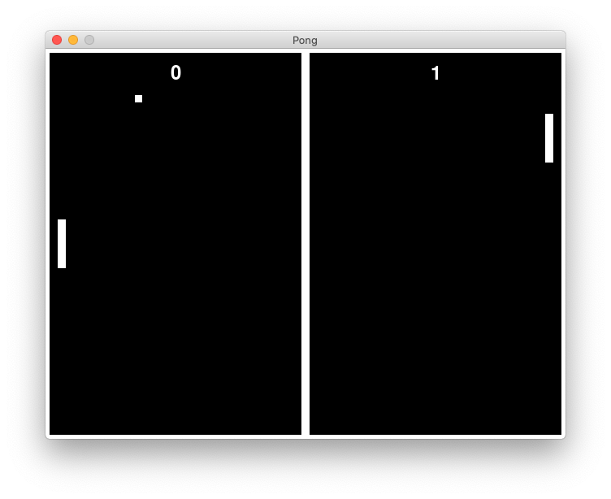

# Writing a Pong Clone with Python and pygame

This tutorial will walk you through the creation of a clone
of the classic video game [Pong](https://en.wikipedia.org/wiki/Pong),
using the [Python](https://python.org) programming language
and the [pygame](https://pygame.org) game engine.

A playlist with videos showing the steps is
[available on YouTube](https://www.youtube.com/playlist?list=PLsGmgprYLmdhoWBwUB-dF-osEhzGBhvS8).

## Installing Python and pygame

On Windows or MacOS,
download the latest version of Python 3
from the [Python website](https://www.python.org/downloads/).
On Linux, install it using your distribution's package manager.

pygame installation is done via `pip`,
the *Package Installer for Python*.
To make sure that pygame works with Python 3
and also works with high-resolution screens
(such as a Mac Retina Display),
we will install pygame version 2,
which is the default by now.

### Windows

On Windows, open up a command line or the PowerShell.
Make sure you have Python3 installed by typing
```
py --version
```
The answer should be something like `Python 3.10.1`.
Install pygame with the following command:
```
py -m pip install -U pygame --user
```

### MacOS and Linux

On a Mac or Linux PC,
open up the Terminal app.
Install pygame with the following command:
```
python3 -m pip install -U pygame --user
```

## Coding Guidelines

Every programming language has its preferred way of writing code in it.
For Python,
these preferences are written down in the
[Python Enhancement Proposal Number 8](https://www.python.org/dev/peps/pep-0008/),
or PEP-8 for short.
The code we will write will be PEP-8 compliant.
I encourage you to review that document,
as many of the principles mentioned also apply to many other programming languages,
and having a consistent coding style will make you a better developer.

## IDLE

We will be using Pyhon's builtin *Integrated Development Environment* (IDE).
Its official name is the *Integrated Development and Learning Environment*,
or IDLE.
You should be able to start it from your operating system's search bar
or program launcher,
once Python is installed.
IDLE is a basic tool that is more than sufficient for our code,
but if you plan to use Python for more elaborate projects,
check out [PyCharm](https://www.jetbrains.com/pycharm/).
PyCharm comes in a free community edition,
which can handle even large Python projects quite nicely.

## Coding the game

Let's get started by creating a new Python module
and write a program to open a window on the screen.

### Open a Window

From the IDLE menu,
choose `File->New File`.
Here is the complete first program that we will write:

```python
import sys
import pygame
from pygame.locals import *

WINDOW_WIDTH = 640
WINDOW_HEIGHT = 480

BLACK = (0, 0, 0)

pygame.init()

# set up the window
DISPLAY_SURFACE = pygame.display.set_mode((WINDOW_WIDTH, WINDOW_HEIGHT))
pygame.display.set_caption('Pong')

# main game loop
while True:
    # process events
    for event in pygame.event.get():
        if event.type == QUIT:
            pygame.quit()
            sys.exit()

    # draw scene
    DISPLAY_SURFACE.fill(BLACK)
    pygame.display.update()
```

Let's walk through the code.
The first three lines import two modules:

```python
import sys
import pygame
from pygame.locals import *
```
The first, `sys`, provides for a way to safely terminate our program
when the user closes the window
(or, later, presses the escape key).
The second one is `pygame` itself.
Pygame comes with a set of local identifiers,
e.g. to identify events and key presses.
These identifiers are used frequently in any pygame game,
and the `from pygame.locals import *` relieves us from the need
to always prefix those names with `pygame.locals`.

The next three lines provide a couple of constant values
that we will use later on in the program:

```python
WINDOW_WIDTH = 640
WINDOW_HEIGHT = 480

BLACK = (0, 0, 0)
```

You may have noticed that we use a single `=` here
and a double `==` later.
The single `=` attaches a value to a name (a.k.a. a *variable*),
whereas the double `==` represents a test for equality
(its result is either true or false).

We chose a window width of 640 pixels, and a window height of 480 pixels.
This is the original
[VGA display resolution](https://en.wikipedia.org/wiki/Video_Graphics_Array).
The variable `BLACK` contains the red, green, and blue (RGB) values
for the color black.
Not surprisingly,
black is the absence of all colors,
and therefore all three individual RGB values are zero.
The notation of several values,
separated by a comma,
and enclosed in parentheses is called a *tuple* in Python.
We will encounter more of them when coding our game.

#### A Note on Constants

The three lines we just wrote define constants,
which are values that will not change during the execution of our game.
By PEP-8 convention,
we use all upper caps letters for the variable names,
so that programmers reading our code will know about our intention.
It is common to collect constants at the top of a program,
so that they are easy to find.
This provides programmers with a single point in the code,
should they want to change the value of a constant.
All subsequent uses of the constant will use the new value.
In game design,
an approach like this enables rapid *testing* and *balancing* of a game.
In the case of Pong,
our initial choice of speed for the ball may be too high or too low,
making the game too hard or boring.
A game tester can then easily and quickly change the ball speed value
by changing the value for the associated constant at the top of the game code.

The next lines initialize pygame,
open a window of the specified size,
and set the window title to *Pong*:

```python
pygame.init()

# set up the window
DISPLAY_SURFACE = pygame.display.set_mode((WINDOW_WIDTH, WINDOW_HEIGHT))
pygame.display.set_caption('Pong')
```

The `DISPLAY_SURFACE` is a constant that represents our game window.
Python does all its drawing on *surfaces*,
and the `DISPLAY_SURFACE` happens to be the one to be connected to our screen.
That connection is set up by the `pygame.display.set_mode()` function call.
Note the double parentheses in that function call.
`(WINDOW_WIDTH, WINDOW_HEIGHT)` is a single tuple with two values,
which is passed to the `set_mode()` function.
As usual in mathematics,
arguments are passed into functions with parentheses,
which explains the second set of them in the function call.
This pattern is common in pygame.

Next comes the main loop of the game.
A video game is essentially an infinite repetition
(a.k.a. *loop*) of three things:

1.  process events
2.  update game state
3.  draw the game scene

#### Process Events

Events are changes that the game needs to react to.
In our case,
this means user input in the form of key presses and releases and,
as in this case,
the `quit` event,
which is generated by pygame
when the user clicks the button to close the game window.

#### Update Game State

Game state is simply referring to all the values of all the variables
and objects that make up our game at any given point in time.
As we will see down the road,
it can be very useful to assign individual,
explicit states to objects such as our paddles
and to define events that allow for transition between those states.
Systems like that are called *Finite State Machines*,
and they are used a lot in game development.
Since there are no events that will change our game state as of now,
that section does not exist in our code yet,
but we will add it shortly.

#### Draw the Game Scene

Just like a movie,
a video game is presented to a player as a sequence of still images,
one *frame* at a time.
In the simplest approach,
taken here,
we simple start with an empty picture at the beginning of each frame,
erasing the previous content by filling it with all black,
and then draw the scene piece by piece,
using the current game state
(e.g. the position of our current game objects, such as our paddles and ball).
When we're done drawing,
we can tell pygame to transfer the current frame to the window on the screen.

Let's now look at the main game loop:

```python
# main game loop
while True:
    # process events
    for event in pygame.event.get():
        if event.type == QUIT:
            pygame.quit()
            sys.exit()

    # draw scene
    DISPLAY_SURFACE.fill(BLACK)
    pygame.display.update()
```

A loop in Python generally looks like this:

```python
while expression:
    do_something()
    do_another_thing()
do_the_next_thing()
```

As long as `expression` is true,
the loop executes `do_something()`.
Python knows what to repeat by using indentation.
The indentation for `do_the_next_thing()` has reverted to the `while` level,
so when Python encounters `do_the_next_thing()`,
it evaluates `expression` again,
and if it is true,
it goes back to the top to execute the loop again,
otherwise,
it ends the loop and executes `do_the_next_thing()`.
Here is an example that counts to 100:

```python
count = 1
while count <= 100:
    print(count)
    count = count + 1
print('Done counting!')
```

`while True:` expresses an infinite loop,
because the expression `True` is constant and will never be false.
The infinite loop only ends when the program ends.

Since we do not have a game yet,
the main loop does not contain an *update game state* section yet.

#### The Process Event Section

The section that processes events looks like this:

```python
for event in pygame.event.get():
    if event.type == QUIT:
        pygame.quit()
        sys.exit()
```

Events can happen at any time during the execution of the main game loop.
pygame collects these events in its `event` list.
The line `for event in pygame.event.get():` starts an *iteration*
over the event list.
For each execution of the iteration
(which is a special case of a loop),
the variable `event` contains the next item from the event list.
The `if` statement then simply checks whether the current event type
is the `QUIT` event,
and if so,
quits pygame and exits the program.
All other events are ignored.

#### The Draw Game Section

The section for drawing the game is very simple for now:

```python
DISPLAY_SURFACE.fill(BLACK)
pygame.display.update()
```

All we do is erase the previous frame by filling the window with black color.
The `pygame.display.update()` call then instructs pygame
to transfer the window content to the computer's screen.
We will add drawing commands between those two lines
when writing the rest of our game.

#### Running the Program

You can run the game by selecting `Run->Run Module` from the IDLE menu.
IDLE will ask you to save the file and give it a name.
Use `pong.py` as the name.
The program will then open an empty window with a black background
and the name *Pong* in its title bar:


### Drawing the Playing Field

Since we'll be drawing the playing field elements in white,
let's add that color,
right after we define `BLACK`:

```python
WHITE = (255, 255, 255)
```

Since white is the presence of all colors,
and individual 8-bit values for red, green, and blue can range from 0 to 255,
white is `(255, 255, 255)`.
All other shades of gray,
down to black,
would have identical RGB values anywhere between 0 and 255.

The playing field will look like this
(colors are inverted, for better readability of the labels):


It consists of 7 rectangles
(which are very convenient in pygame to create, manipulate, and draw):

1.  `NET`
2.  `TOP_BOUNDARY`
3.  `BOTTOM_BOUNDARY`
4.  `LEFT_BOUNDARY`
5.  `RIGHT_BOUNDARY`
6.  `left_paddle`
7.  `right_paddle`

Note that we have already named the rectangles which will not move
using all caps letters,
indicating that they are constant objects in Python.
Likewise,
since the paddles will move up and down,
and therefore change when the program runs,
we have named them using lower caps letters,
in accordance with PEP-8.

Moving or not,
all these rectangles,
with the exception of the net,
will interact with the ball,
as the ball will bounce off the paddles and the top and bottom boundaries.
Also, when the ball hits either the left or right boundary,
we know that the respective player has missed it with the paddle,
and the opposing player will be awarded a point.

We can pick our values for `NET_WIDTH`, `BOUNDARY_THICKNESS`, `PADDLE_WIDTH`,
`PADDLE_HEIGHT`, and `PADDLE_OFFSET` any way that is aesthetically pleasing
and --- more importantly --- to enhance game play.
For now, we will choose

```python
BOUNDARY_THICKNESS = 5

NET_WIDTH = 10
```

with all measurements being in pixels.
We will choose the values for the paddles
after we're done drawing the constant parts of the game.
Those lines will be added right after the creation of the color constants.

Pygame's coordinate system has its coordinate system origin
in the top left corner of the window.
Increasing the x-coordinate will move to the right,
increasing the y-coordinate will move down.
If you are familiar with the Cartesian coordinate system from mathematics
(origin is bottom left and increasing y moves up),
this may look unusual,
but all 2D game engines work that way.
This comes from the original electron beam of a cathode-ray tube
(a.k.a. television),
starting at the top left of the screen and moving right and down
to draw the picture.
Early video games could use the time it took for the electron beam
to move across the screen to complete some computations
before the beam arrived to draw an object.

When pygame draws a rectangle on the screen at position `(x, y)`,
it will treat those coordinates as the top left of the rectangle to be drawn.
The top left corner is said to be the *anchor point* or *hot spot*
of the rectangle.

Thus,
creating the `TOP_BOUNDARY` is trivial,
as its anchor point coincides with the origin,
and it has a width equal to `WINDOW_WIDTH`,
and a height equal to `BOUNDARY_THICKNESS`:

```python
TOP_BOUNDARY = pygame.Rect(0,
                           0,
                           WINDOW_WIDTH,
                           BOUNDARY_THICKNESS)
```

The `NET` is trickier.
Its y-coordinate still is at the top of the screen
(i.e. `0`),
but its x-coordinate is *not* in the center of the screen.
We want the *center* of the rectangle to be in the center of the screen,
which means we must move the anchor point's x-coordinate to the left
(i.e. *subtract*)
by `NET_WIDTH/2`.
The position and dimensions of the `NET` therefore is:

```python
NET = pygame.Rect(WINDOW_WIDTH/2 - NET_WIDTH/2, 0, NET_WIDTH, WINDOW_HEIGHT)
```

#### A Note on Code Layout

You have probably noted that the layout of the code for `TOP_BOUNDARY`
and `NET` looks different.
The simple reason for this is that PEP-8 recommends to not exceed a line length
of 80 characters (columns).
The deeper reason for this is code readability,
and connected to the reason why traditional newspapers
(remember those?)
use a multi-column layout.
About 80 characters
(give or take)
can be read by humans without the need to move their heads.
Therefore,
restricting the length of lines of code
enables us to read and comprehend code more quickly,
which is essential for efficient code review and improved code quality.

We can now add those two lines after the creation of our previous constants.
The `BOTTOM_BOUNDARY` needs an adjustment similar to the `NET`.
Its anchor point's x-coordinate is zero,
as it coincides with the left edge of the window,
but its y-coordinate needs to be lifted
(i.e. subtracted)
from the bottom by `BOUNDARY_THICKNESS`:

```python
BOTTOM_BOUNDARY = pygame.Rect(0,
                              WINDOW_HEIGHT - BOUNDARY_THICKNESS,
                              WINDOW_WIDTH,
                              BOUNDARY_THICKNESS)
```

For `LEFT_BOUNDARY` and `RIGHT_BOUNDARY`,
the situation is reversed in terms of the x- and y-coordinates,
but otherwise identical:

```python
LEFT_BOUNDARY = pygame.Rect(0,
                            0,
                            BOUNDARY_THICKNESS,
                            WINDOW_HEIGHT)
RIGHT_BOUNDARY = pygame.Rect(WINDOW_WIDTH - BOUNDARY_THICKNESS,
                             0,
                             BOUNDARY_THICKNESS,
                             WINDOW_HEIGHT)
```

With all those lines of code added before `pygame.init()`,
we can now draw those rectangles in the main game loop.
Just after `DISPLAY_SURFACE.fill(BLACK)`
and before `pygame.display.update()`,
we add the follwing code:

```python
for rect in (NET,
             TOP_BOUNDARY, BOTTOM_BOUNDARY,
             LEFT_BOUNDARY, RIGHT_BOUNDARY):
    pygame.draw.rect(DISPLAY_SURFACE, WHITE, rect)
```

This collects all our rectangles into a tuple
(note the parentheses around the comma-separated list),
and iterates over each one,
drawing it in white on the `DISPLAY_SURFACE`,
i.e. the screen.
Using iteration over a tuple saves us from typing the same `draw()` command
over and over, where nothing but the name of the rectangle to be drawn
would have changed.

Running the program at this stage produces the following window:



### Drawing and Moving the Paddles

Let's chose our paddle geometry:

```python
PADDLE_WIDTH = 10
PADDLE_HEIGHT = 60
PADDLE_OFFSET = 10
```

The position of `left_paddle` is `PADDLE_OFFSET` to the right
of the right edge of `LEFT_BOUNDARY`,
which in itself it `BOUNDARY_THICKNESS` to the right
of the left edge of the screen.
The x-coordinate of `left_paddle` thus is
`BOUNDARY_THICKNESS + PADDLE_OFFSET`.
Similar to the `NET`,
we want the initial position of the paddles to be
at the center of the `WINDOW_HEIGHT`,
which means we have to subtract half of the `PADDLE_HEIGHT`.
The y-coordinate of the left_paddle therefore is
`WINDOW_HEIGHT/2 - PADDLE_HEIGHT/2`.
We can thus create the `left_paddle` right after the `RIGHT_BOUNDARY`
with the following line of code:

```python
left_paddle = pygame.Rect(BOUNDARY_THICKNESS + PADDLE_OFFSET,
                          WINDOW_HEIGHT/2 - PADDLE_HEIGHT/2,
                          PADDLE_WIDTH,
                          PADDLE_HEIGHT)
```

Using similar calculations for the `right_paddle`,
we get

```python
right_paddle = pygame.Rect(WINDOW_WIDTH - BOUNDARY_THICKNESS -
                           PADDLE_OFFSET- PADDLE_WIDTH,
                           WINDOW_HEIGHT/2 - PADDLE_HEIGHT/2,
                           PADDLE_WIDTH,
                           PADDLE_HEIGHT)
```

We add the paddles to the tuple in the drawing commands:

```python
for rect in (NET,
             TOP_BOUNDARY, BOTTOM_BOUNDARY,
             LEFT_BOUNDARY, RIGHT_BOUNDARY,
             left_paddle, right_paddle):
    pygame.draw.rect(DISPLAY_SURFACE, WHITE, rect)
```

When we run the program now,
we see the paddles in the scene,
but of course they are stationary as we have not written the code yet
to move them.

#### The Paddle Finite State Machine

When we move the paddles,
the game engine still only gives us a snapshot in time.
The movement is an illusion based on the rapid succession of still pictures.
We therefore need a way to record the *state* each of the paddles is in
at any given point in time.
Each paddle can be in one of three states:

1.  stopped
2.  moving up
3.  moving down

The following lines of code create constants representing those states:
```python
# paddle states
PADDLE_STOP = 'stop'
PADDLE_UP = 'up'
PADDLE_DOWN = 'down'
```

We will add them right after the lines defining our paddle size.
In order to change state
(or, more formally, to *transition* from one state to another),
some sort of event has to happen.
Let's assume the initial state of our left paddle is `PADDLE_STOP.`
The keys to move our paddle will be `W` and `S`
(of [WASD fame](https://www.pcgamer.com/how-wasd-became-the-standard-pc-control-scheme/))
for the left paddle
and the up and down arrows for the right paddle.
If the left player presses the `W` key *down*,
the left paddle should transition to the `PADDLE_UP` state.
If the left player *releases* the `W` key,
the left paddle should transition from the `PADDLE_UP` state
back to the `PADDLE_STOP` state.
Note that we don't define what happens
when the player holds the key pressed down,
as this is a state,
not an event.
As a matter of fact,
the way we set up our states,
holding the `W` key down is identical to being in the `PADDLE_UP` state.
We can easily extend this system to cover the `PADDLE_DOWN` state, as well.
In engineering,
what we have created,
is called a
[*Finite State Machine*](https://en.wikipedia.org/wiki/Finite-state_machine) (FSM).
It is a very powerful concept,
and engineers have developed a formal, graphical representation
for it.
Graphically,
our FSM looks like this:



The initial state is indicated by the transition arrow
from the little black dot.

The following two lines,
added just after we have created our paddle rectangles,
represent the initial state of our paddles:

```python
left_paddle_state = PADDLE_STOP
right_paddle_state = PADDLE_STOP
```

Pygame gives us two event types for key presses,
`KEYDOWN` and `KEYUP`.
When receiving these event types,
we can check on which key has been pressed or released
and update our states accordingly.

The modified event processing loop looks long
(which is about normal for code expressing even simple concepts),
but not very complicated.
Reading it,
you will find it is an exact representation of our finite state machine:

```python
    # process events
    for event in pygame.event.get():
        if event.type == QUIT:
            pygame.quit()
            sys.exit()
        elif event.type == KEYDOWN:
            if event.key == K_ESCAPE:
                pygame.quit()
                sys.exit()
            # update paddle state
            if event.key == K_w and left_paddle_state == PADDLE_STOP:
                left_paddle_state = PADDLE_UP
            elif event.key == K_s and left_paddle_state == PADDLE_STOP:
                left_paddle_state = PADDLE_DOWN
            elif event.key == K_UP and right_paddle_state == PADDLE_STOP:
                right_paddle_state = PADDLE_UP
            elif event.key == K_DOWN and right_paddle_state == PADDLE_STOP:
                right_paddle_state = PADDLE_DOWN
        elif event.type == KEYUP:
            # update paddle state
            if event.key == K_w and left_paddle_state == PADDLE_UP:
                left_paddle_state = PADDLE_STOP
            elif event.key == K_s and left_paddle_state == PADDLE_DOWN:
                left_paddle_state = PADDLE_STOP
            elif event.key == K_UP and right_paddle_state == PADDLE_UP:
                right_paddle_state = PADDLE_STOP
            elif event.key == K_DOWN and right_paddle_state == PADDLE_DOWN:
                right_paddle_state = PADDLE_STOP
```

We have also added an additional event handler for the `ESC` key
being pressed down,
so that the game can be ended either by closing the window,
or by pressing the `ESC` key.

The state of our paddles now directly affects the state of our whole game.
If, e.g. the left paddle is in the `PADDLE_DOWN` state,
we need to increase its y-coordinate value by a certain amount.
We will call this the `PADDLE_SPEED`.
It is measured in pixels per frame,
and we add it to the other constants defining our paddles:

```python
PADDLE_WIDTH = 10
PADDLE_HEIGHT = 60
PADDLE_OFFSET = 10
PADDLE_SPEED = 10
```

The code updating the game state then is fairly straightforward,
and we will add it to the `update game state` section of our game:

```python
    # update game state
    if left_paddle_state == PADDLE_UP:
        left_paddle.y -= PADDLE_SPEED
    elif left_paddle_state == PADDLE_DOWN:
        left_paddle.y += PADDLE_SPEED

    if right_paddle_state == PADDLE_UP:
        right_paddle.y -= PADDLE_SPEED
    elif right_paddle_state == PADDLE_DOWN:
        right_paddle.y += PADDLE_SPEED
```

Running this code,
the paddles will move accordingly,
but there are two problems:

1.  Depending on your computer's speed,
    the paddles may move very fast.
2.  The paddles can move out of the playing field.

We will fix the first one now,
and introduce how to stop the second problem from happening
using *collision detection* in the next section.

In the current version of the game,
pygame executes the event loop as fast as it can.
This means that after pygame is done drawing the scene,
it immediately returns to the beginning of the main game loop,
processes events,
and updates game state,
and then proceeds to draw the new scene again.
On a fast computer,
this leads to a high frame rate,
on a slower computer to a lower one.
Also,
depending on the events and states,
processing and updating may take longer for some frames than others,
resulting in a *variable* frame rate.
Pygame has been designed for a *fixed* frame rate
to avoid all these problems.
In order to achieve a fixed frame rate,
we need to first decide on a frame rate that is high enough
to give us the illusion of smooth movement,
but low enough as to not overpower slower computers.
30 frames per second is a good value.
We can add the following to our constants section,
right after the definition of our paddle states:

```python
FRAMES_PER_SECOND = 30
```

We then need a clock to measure time.
Python provides us one.
Right after `pygame.init()`,
we can add the following line to establish our frame rate clock:

```python
FPS_CLOCK = pygame.time.Clock()
```

At the very end of our main game loop,
just after `pygame.display.update()`,
we will add the following line:

```python
    FPS_CLOCK.tick(FRAMES_PER_SECOND)
```

Pygame will use this to essentially pause the game
for just the right amount of time
to achieve a frame rate of 30 frames per second.

The following picture shows the game in its current state,
with the left paddle partially moved down off the screen
and the right paddle moved up:



### Stopping the Paddles at the Boundaries

When a paddle hits a boundary,
it needs to be put into the `PADDLE_STOP` state.
More generally,
"hitting" something in a game is referred to as a *collision*
between two game objects.

The need for collision detection is so common in game engines,
that they all support multiple efficient ways to perform it.
In pygame,
we can use the `colliderect()` method to detect a collision
between any two rectangles.
The following lines of code demonstrate how to detect a collision
between the left paddle and the top boundary.
This code should be inserted right after we have moved the paddles:

```python
    # stop paddles at top and bottom boundaries
    if left_paddle.colliderect(TOP_BOUNDARY):
        left_paddle_state = PADDLE_STOP
        left_paddle.top = TOP_BOUNDARY.bottom
```

If a collision is detected,
the paddle is put into the `PADDLE_STOP` state,
and the paddle's `top` is aligned to the boundary's `bottom`,
as it may already have moved further into the boundary.
This relieves us from the tedious offset calculations
involving the anchor points.
The code for the other combinations of paddle and boundary conditions
is very similar:

```python
    if left_paddle.colliderect(BOTTOM_BOUNDARY):
        left_paddle_state = PADDLE_STOP
        left_paddle.bottom = BOTTOM_BOUNDARY.top

    if right_paddle.colliderect(TOP_BOUNDARY):
        right_paddle_state = PADDLE_STOP
        right_paddle.top = TOP_BOUNDARY.bottom
    if right_paddle.colliderect(BOTTOM_BOUNDARY):
        right_paddle_state = PADDLE_STOP
        right_paddle.bottom = BOTTOM_BOUNDARY.top
```

Running the code now results in the paddles staying on the screen.

### Moving and Bouncing the Ball off the Paddles

When introducing the ball,
we need to decide on its size and speed.
We add the following lines after we set our `FRAMES_PER_SECOND`:

```python
BALL_SPEED = 8
BALL_SIZE = 9
```

Since the ball is square,
using an odd number of pixels for its size is useful,
as then the ball's center always aligns fully with a pixel on the screen.

#### The Game Finite State Machine

We could be tempted to define states for the ball
similar to those of the paddles,
but the ball really is always moving,
unless there's a pause in the game or the game is over.
This means the ball state is directly tied to the game state,
so it is more useful to define game states at this point.

The game can be in any of three states:

```python
# game states
GAME_ON = 'on'
GAME_STOP = 'stop'
GAME_OVER = 'over'
```

We can add those lines of code directly
after the definition of our paddle states.

The finite state machine for our game looks a little different from
and is more complex than
the FSM for the paddles:



The game starts in the `GAME_OVER` state.
Any key press will start the game and put it into the `GAME_ON` state.
If the ball hits the left or right boundary,
we know that the corresponding player has missed it,
so the game enters the `GAME_STOP` state,
and the opponent's score is increased by 1.
If that score reaches 11 points,
the game enters the `GAME_OVER` state again.
Otherwise,
any key press will return to the `GAME_ON` state.

#### Putting the Ball into the Game

Just after where we have created our paddles and their states,
we put the following lines of code to create the ball
and initialize our game state machine:

```python
ball = pygame.Rect(WINDOW_WIDTH/2 - BALL_SIZE/2,
                   WINDOW_HEIGHT/2 - BALL_SIZE/2,
                   BALL_SIZE,
                   BALL_SIZE)

ball_speed_x = BALL_SPEED
ball_speed_y = 0

game_state = GAME_OVER
```

The ball has a constant `BALL_SPEED`,
but it will be moving around our field in two dimensions,
so its [*velocity*](https://en.wikipedia.org/wiki/Velocity)
will have two components,
`ball_speed_x` and `ball_speed_y`.
For now,
`ball_speed_x` contains all the `BALL_SPEED`,
so the ball is moving along the x-axis and does not move in the y-direction.

The next step is somewhat tedious.
Since we only need to perform collision detection when the game is on,
we modify the collision detection code to look like the following:

```python
    # update game state
    if game_state == GAME_ON:
        if left_paddle_state == PADDLE_UP:
            left_paddle.y -= PADDLE_SPEED
        elif left_paddle_state == PADDLE_DOWN:
            left_paddle.y += PADDLE_SPEED

        if right_paddle_state == PADDLE_UP:
            right_paddle.y -= PADDLE_SPEED
        elif right_paddle_state == PADDLE_DOWN:
            right_paddle.y += PADDLE_SPEED

        # stop paddles at top and bottom boundaries
        if left_paddle.colliderect(TOP_BOUNDARY):
            left_paddle_state = PADDLE_STOP
            left_paddle.top = TOP_BOUNDARY.bottom
        if left_paddle.colliderect(BOTTOM_BOUNDARY):
            left_paddle_state = PADDLE_STOP
            left_paddle.bottom = BOTTOM_BOUNDARY.top

        if right_paddle.colliderect(TOP_BOUNDARY):
            right_paddle_state = PADDLE_STOP
            right_paddle.top = TOP_BOUNDARY.bottom
        if right_paddle.colliderect(BOTTOM_BOUNDARY):
            right_paddle_state = PADDLE_STOP
            right_paddle.bottom = BOTTOM_BOUNDARY.top
```

The easiest way to achieve this is to first add the line

```python
if game_state == GAME_ON:
```

and then mark the rest of the code and choose `Format->Indent Region`
from the IDLE menu.

We partially implement the `KEYDOWN` part of the game FSM
by adding the following lines just after we handle the `K_ESCAPE` event
but before we update the paddle state:

```python
            # update game state
            if game_state == GAME_OVER or game_state == GAME_STOP:
                game_state = GAME_ON
```

Moving the ball is simple and similar to moving the paddles.
We add the following lines of code after the paddle collision detection:

```python
# update ball position
ball.x += ball_speed_x
ball.y += ball_speed_y
```

The only difference to moving the paddles is
that the ball moves in two dimensions,
whereas the paddles only move in one.

The ball can now be drawn by adding it to the tuple for the drawing command:

```python
    for rect in (NET,
             TOP_BOUNDARY, BOTTOM_BOUNDARY,
             LEFT_BOUNDARY, RIGHT_BOUNDARY,
             left_paddle, right_paddle, ball):
        pygame.draw.rect(DISPLAY_SURFACE, WHITE, rect)
```

Running the game now and pressing any key will show,
that the ball originates from the center of the playing field,
moves towards the right paddle,
and then moves off the screen,
as we have not implemented any collision detection and bouncing
for the ball yet.

#### Bouncing the Ball

Collision detection with the paddles is easily done in pygame.
The question is rather,
what do we do when the ball hits a paddle?
What does it mean to *bounce*,
mathematically speaking?
In a classic, ideal reflection,
the overall speed of an object stays the same,
but the component of the velocity *perpendicular* to the orientation
of the reflecting object changes direction
(positive to negative or vice versa).
The following code,
placed just after our ball position update
achieves this for collisions with the ball for each paddle:

```python
        # bounce ball off paddles and boundaries
        if ball.colliderect(left_paddle) or ball.colliderect(right_paddle):
            if ball.colliderect(left_paddle):
                ball.left = left_paddle.right
            else:
                ball.right = right_paddle.left
            ball_speed_x = -ball_speed_x
```

The speed component perpendicular to the paddle is the x-component,
which is the one we flip the sign on.
As with the paddles and the boundaries,
we first align the ball with the paddle surface,
and then flip the `ball_speed_x` sign direction.

Running this code will bounce the balls between the two paddles forever.
If a player moves a paddle out of the way,
the ball will still travel outside of our playing field forever.
Let's fix this now.

#### Stopping the Game when the Ball is Out of Bounds

Given our game state machine and pygame's collision detection,
stopping the game when the ball is out of bounds is extremely simple.
All it takes are the following lines of code,
added directly after the collision detection between ball and paddles
that we have in the previous section:

```python
        if ball.colliderect(LEFT_BOUNDARY) or ball.colliderect(RIGHT_BOUNDARY):
            game_state = GAME_STOP
            ball.center = (WINDOW_WIDTH/2, WINDOW_HEIGHT/2)
```

In addition to stopping the game,
we put the ball back where it came from,
i.e. the center of the screen.

Running the game now leads to a stable state machine,
as we now transition from the `GAME_OVER` to the `GAME_ON` state initially.
After that,
we transition to `GAME_STOP` when the ball goes out of bounds,
and then again to `GAME_ON` on any key press.
To reach the `GAME_OVER` state again,
we will have to implement scoring,
but before we do that,
we will make things more interesting by giving the ball's velocity
a non-zero y-component and achieve true two-dimensional movement.

### Moving the Ball at an Angle

Moving the ball at an angle requires a bit of trigonometry and vector math.
If the ball travels at an `angle` (say about 30º) with respect to the x-axis,
and has a speed of `BALL_SPEED` in that direction
(i.e. its *velocity*),
that velocity can be decomposed into a velocity along the x-axis
and a velocity along the y-axis as in the following vector diagram:



`BALL_SPEED`, `ball_speed_x`, and `ball_speed_y` form a
[right triangle](https://en.wikipedia.org/wiki/Right_triangle),
with `BALL_SPEED` as its hypotenuse,
`ball_speed_x` being adjacent to `angle`,
and `ball_speed_y` being opposite to `angle`.
From the trigonometric ratios,
we can deduce that

```python
ball_speed_x = BALL_SPEED * cos(angle)
ball_speed_y = BALL_SPEED * sin(angle)
```

where `sin()` is the sine function and `cos()` is the cosine function.

In order to start the ball traveling at an angle,
we first will have to pick a maximum allowable starting angle.
If the angle is too large,
it will take too long for the ball to reach a paddle.
So let's add the following line to our constants section,
right after our `BALL_SPEED` and `BALL_SIZE`:

```python
MAX_ANGLE = 30
```

We need to import the sine and cosine functions from the math module.
These functions expect angles to be in radians,
rather than degrees, so we also need to import a conversion function.
We also import the random module to access random functions.
We add the following to our imports section at the very top of the code:

```python
from math import sin, cos, radians
import random
```

Now all we have to do is pick a random angle
when the game enters the `GAME_ON` state
(which happens when we handle the `KEYDOWN` event),
and use the equations above to set the x- and y-components of the speed:

```python
            # update game state
            if game_state == GAME_OVER or game_state == GAME_STOP:
                # pick initial angle
                angle = radians(random.randint(-MAX_ANGLE, +MAX_ANGLE))
                ball_speed_x = BALL_SPEED * cos(angle)
                ball_speed_y = BALL_SPEED * sin(angle)
                # pick initial direction
                ball_speed_x *= random.choice((-1, 1))
                game_state = GAME_ON
```

The `random.choice((-1, 1))` line randomly picks
whether the initial x-component is to the left (negative)
or to the right (positive).

By now,
we know from the paddles how to bounce things.
The difference is that for bouncing off the top and bottom boundaries,
we will have to flip the sign for the y-component,
rather than the x-component of the speed
Let's add the following after the code for the paddle bounce:

```python
if ball.colliderect(TOP_BOUNDARY) or ball.colliderect(BOTTOM_BOUNDARY):
    if ball.colliderect(TOP_BOUNDARY):
        ball.top = TOP_BOUNDARY.bottom
    else:
        ball.bottom = BOTTOM_BOUNDARY.top
    ball_speed_y = -ball_speed_y
```

That's it.
Running the game now,
we have a fully functioning Pong game.
The only thing missing is the scoring.

### Add Scores to the Game

In the original Pong,
the first player to reach 11 points wins.
In addition to that constant,
we need to also add constants for the positions on the screen
where we will display the scores.
We will add those to the constants section of our code:

```python
MAX_SCORE = 11
SCORE_POS_Y = 30
SCORE_POS_LEFT = WINDOW_WIDTH/4
SCORE_POS_RIGHT = WINDOW_WIDTH * 3/4
```

We need to initialize our scores,
just after we set `game_state = GAME_OVER`:

```python
left_score = 0
right_score = 0
```

#### Displaying the Game Over Message

Displaying Text in pygame is more complicated than drawing rectangles.
The text needs to be *rendered* from the mathematical description of its *font*
to pixels on a pygame *surface*.
That surface is *not* the `DISPLAY_SURFACE`,
but rather a container for the rendered pixels.
Let's start with the "Game Over" message,
as its contents and position is constant.
Not surprisingly,
the message is displayed whenever the game is in the `GAME_OVER` state.
We add the following code just after `pygame.init()`:

```python
FONT = pygame.font.Font('freesansbold.ttf', 24)
GAME_OVER_SURFACE = FONT.render('GAME     OVER ',
                                True, WHITE)
GAME_OVER_RECT = GAME_OVER_SURFACE.get_rect()
GAME_OVER_RECT.center = (WINDOW_WIDTH/2, WINDOW_HEIGHT/2)
```
The 5 spaces in the message string are simply there
to avoid interference of the net with the text.
In order to place the text on the screen,
we need to render the text to a surface,
but to position that surface,
we need a rect that is essentially the boundary rectangle
around the rendered text.
The `GAME_OVER_SURFACE.get_rect()` call computes that rectangle for us.

Let's display that message by adding the following
just before `pygame.display.update()`:

```python
if game_state == GAME_OVER:
        DISPLAY_SURFACE.blit(GAME_OVER_SURFACE, GAME_OVER_RECT)
```

The word `blit` is short for *block image transfer*.
In the early days of video games,
graphics systems had a special chip that could take a bunch of pixels
(like our `GAME_OVER_SURFACE`, sometimes referred to as *sprites*)
and very quickly and efficiently insert it into the graphics memory
(like our `DISPLAY_SURFACE`) at a given position
(like our `GAME_OVER_RECT`).
These chips were called *blitters*,
and the name stuck.
Graphics cards to this day have special memory areas for storing sprites,
and still have special commands for blitting.

Running the game now will display the game over message at startup.
Once the game is going,
the message disappears.
At this time, we will never see the message again,
as the `GAME_OVER` state can only be reached by scoring 11 points,
which we haven't implemented yet.

#### Tracking and Displaying the Score

Keeping track of score is straightforward.
We simply need to add the following code when we check for ball collisions
with the boundaries
(make sure to add this after `game_state = GAME_STOP`
and before `ball.center = (WINDOW_WIDTH/2, WINDOW_HEIGHT/2)`:

```python
            if ball.colliderect(LEFT_BOUNDARY):
                right_score += 1
            if ball.colliderect(RIGHT_BOUNDARY):
                left_score += 1
            if left_score == MAX_SCORE or right_score == MAX_SCORE:
                game_state = GAME_OVER
```

We also need to reset the score when the game restarts.
Just after we have chosen the ball angle and direction
and before we transition to the `GAME_ON` state,
we can add the lines

```python
                # reset score
                if game_state == GAME_OVER:
                    left_score = 0
                    right_score = 0
```

Blitting the score is more complicated than blitting the game over message,
as the text is not constant.

Before the lines that display the game over message,
add the following code:

```python
    left_score_surface = FONT.render('{:d}'.format(left_score), True, WHITE)
    right_score_surface = FONT.render('{:d}'.format(right_score), True, WHITE)
    left_score_rect = left_score_surface.get_rect()
    right_score_rect = right_score_surface.get_rect()
    left_score_rect.center = (SCORE_POS_LEFT, SCORE_POS_Y)
    right_score_rect.center = (SCORE_POS_RIGHT, SCORE_POS_Y)
    DISPLAY_SURFACE.blit(left_score_surface, left_score_rect)
    DISPLAY_SURFACE.blit(right_score_surface, right_score_rect)
```

For each score,
the `format()` call converts the score (which is a number)
to a string of characters representing that number.
That string is then rendered to a surface.
The associated rect is retrieved and its center adjusted
to the intended output position.
Finally,
the score surfaces are blitted to the `DISPLAY_SURFACE`.

We have finally finished our game.
Running and playing the game should look something like this:



## Conclusion

The final game took us about 220 lines of code to implement.
For a simple game engine like pygame,
this is remarkably short and a testament to Python's and pygame's quality.
Having been through the experience,
I hope you agree that the code is quite readable.
More complex game engines like [Unity](https://unity.com)
or [Unreal](https://www.unrealengine.com)
are more sophisticated,
but still operate within the event-update-drawing paradigm
with more sophisticated methods of collision detection
and builtin physics engines.
Give them a test drive,
now that you know the principles behind game engines.

### Challenges

We can still improve our Pong game,
if you're up for a challenge.
Here are some suggestions:

#### Add Sound

The game is silent for now.
Pygame [does support sound](https://www.pygame.org/docs/ref/mixer.html).
Make some noise when the ball hits the paddle.
Play back a tune when the game is over.

#### Increase Difficulty

Play with the constants in the game to make it more challenging.
Make the paddles smaller.
Make the ball move faster.
Maybe increase the speed of the ball,
making it faster the longer it is in play.

#### Make the Paddles more Dynamic

In the original Pong,
the paddles were divided into 8 sections.
Each section would return the ball at a different angle,
simulating slicing the ball as one would in table tennis.

## License

SPDX-License-Identifier: CC-BY-SA-4.0

Copyright (C) 2020
Jens Hannemann, Kentucky State University, jens.hannemann@kysu.edu
