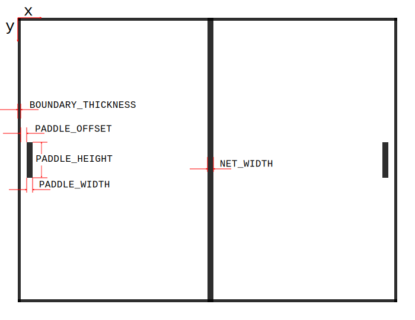

# Writing a Pong Clone with Python and pygame

This tutorial will walk you through the creation of a clone
of the classic video game [Pong](https://en.wikipedia.org/wiki/Pong),
using the [Python](https://python.org) programming language
and the [pygame](https://pygame.org) game engine.

## Installing Python and pygame

On Windows or MacOS,
download the latest version of Python 3
from the [Python website](https://www.python.org/downloads/).
On Linux, install it using your distribution's package manager.

pygame installation is done via `pip`,
the *Package Installer for Python*.
To make sure that pygame works with Python 3
and also works with high-resolution screens
(such as a Mac Retina Display),
we will install the latest beta version for pygame 2.
As of this writing, the pygame developers are close
to officially release pygame 2.0,
so we should not run into any issues with the beta version.

### Windows

On Windows, open up a command line or the PowerShell.
Make sure you have Python3 installed by typing
```
py --version
```
The answer should be something like `Python 3.8.3`.
Install pygame with the following command:
```
py -m pip install -U 'pygame>=2.0.0-dev10' --user
```

### MacOS and Linux

On a Mac or Linux PC,
open up the Terminal app.
Install pygame with the following command:
```
python3 -m pip install -U 'pygame>=2.0.0-dev10' --user
```

## Coding Guidelines

Every programming language has its preferred way of writing code in it.
For Python,
these preferences are written down in the
[Python Enhancement Proposal Number 8](https://www.python.org/dev/peps/pep-0008/),
or PEP-8 for short.
The code we will write will be PEP-8 compliant.
I encourage you to review that document,
as many of the principles mentioned also apply to many other programming languages,
and having a consistent coding style will make you a better developer.

## IDLE

We will be using Pyhon's builtin *Integrated Development Environment* (IDE).
Its official name is the *Integrated Development and Learning Environment*,
or IDLE.
You should be able to start it from your operating system's search bar
or program launcher,
once Python is installed.
IDLE is a basic tool that is more than sufficient for our code,
but if you plan to use Python for more elaborate projects,
check out [PyCharm](https://www.jetbrains.com/pycharm/).
PyCharm comes in a free community edition,
which can handle even large Python projects quite nicely.

## Coding the game

Let's get started by creating a new Python module
and write a program to open a window on the screen.

### Open a Window

From the IDLE menu,
choose `File->New File`.
Here is the complete first program that we will write:

```python
import sys
import pygame
from pygame.locals import *

WINDOW_WIDTH = 640
WINDOW_HEIGHT = 480

BLACK = (0, 0, 0)

pygame.init()

# set up the window
DISPLAY_SURFACE = pygame.display.set_mode((WINDOW_WIDTH, WINDOW_HEIGHT))
pygame.display.set_caption('Pong')

# main game loop
while True:
    # process events
    for event in pygame.event.get():
        if event.type == QUIT:
            pygame.quit()
            sys.exit()

    # draw scene
    DISPLAY_SURFACE.fill(BLACK)
    pygame.display.update()
```

Let's walk through the code.
The first three lines import two modules:

```python
import sys
import pygame
from pygame.locals import *
```
The first, `sys`, provides for a way to safely terminate our program
when the user closes the window
(or, later, presses the escape key).
The second one is `pygame` itself.
Pygame comes with a set of local identifiers,
e.g. to identify events and key presses.
These identifiers are used frequently in any pygame game,
and the `from pygame.locals import *` relieves us from the need
to always prefix those names with `pygame.locals`.

The next three lines provide a couple of constant values
that we will use later on in the program:

```python
WINDOW_WIDTH = 640
WINDOW_HEIGHT = 480

BLACK = (0, 0, 0)
```

We chose a window width of 640 pixels, and a window height of 480 pixels.
This is the original
[VGA display resolution](https://en.wikipedia.org/wiki/Video_Graphics_Array).
The variable `BLACK` contains the red, green, and blue (RGB) values
for the color black.
Not surprisingly,
black is the absence of all colors,
and therefore all three individual RGB values are zero.
The notation of several values,
separated by a comma,
and enclosed in parentheses is called a *tuple* in Python.
We will encounter more of them when coding our game.

#### A Note on Constants

The three lines we just wrote define constants,
which are values that will not change during the execution of our game.
By PEP-8 convention,
we use all upper caps letters for the variable names,
so that programmers reading our code will know about our intention.
It is common to collect constants at the top of a program,
so that they are easy to find.
This provides programmers with a single point in the code,
should they want to change the value of a constant.
All subsequent uses of the constant will use the new value.
In game design,
an approach like this enables rapid *testing* and *balancing* of a game.
In the case of Pong,
our initial choice of speed for the ball may be too high or too low,
making the game too hard or boring.
A game tester can then easily and quickly change the ball speed value
by changing the value for the associated constant at the top of the game code.

The next lines initialize pygame,
open a window of the specified size,
and set the window title to *Pong*:

```python
pygame.init()

# set up the window
DISPLAY_SURFACE = pygame.display.set_mode((WINDOW_WIDTH, WINDOW_HEIGHT))
pygame.display.set_caption('Pong')
```

The `DISPLAY_SURFACE` is a constant that represents our game window.
Python does all its drawing on *surfaces*,
and the `DISPLAY_SURFACE` happens to be the one to be connected to our screen.
That connection is set up by the `pygame.display.set_mode()` function call.
Note the double parentheses in that function call.
`(WINDOW_WIDTH, WINDOW_HEIGHT)` is a single tuple with two values,
which is passed to the `set_mode()` function.
As usual in mathematics,
arguments are passed into functions with parentheses,
which explains the second set of them in the function call.
This pattern is common in pygame.

Next comes the main loop of the game.
A video game is essentially an infinite repetition
(a.k.a. *loop*) of three things:

1.  process events
2.  update game state
3.  draw the game scene

#### Process Events

Events are changes that the game needs to react to.
In our case,
this means user input in the form of key presses and releases and,
as in this case,
the `quit` event,
which is generated by pygame
when the user clicks the button to close the game window.

#### Update Game State

Game state is simply referring to all the values of all the variables
and objects that make up our game at any given point in time.
As we will see down the road,
it can be very useful to assign individual,
explicit states to objects such as our paddles
and to define events that allow for transition between those states.
Systems like that are called *Finite State Machines*,
and they are used a lot in game development.
Since there are no events that will change our game state as of now,
that section does not exist in our code yet,
but we will add it shortly.

#### Draw the Game Scene

Just like a movie,
a video game is presented to a player as a sequence of still images,
one *frame* at a time.
In the simplest approach,
taken here,
we simple start with an empty picture at the beginning of each frame,
erasing the previous content by filling it with all black,
and then draw the scene piece by piece,
using the current game state
(e.g. the position of our current game objects, such as our paddles and ball).
When we're done drawing,
we can tell pygame to transfer the current frame to the window on the screen.

Let's now look at the main game loop:

```python
# main game loop
while True:
    # process events
    for event in pygame.event.get():
        if event.type == QUIT:
            pygame.quit()
            sys.exit()

    # draw scene
    DISPLAY_SURFACE.fill(BLACK)
    pygame.display.update()
```

A loop in Python generally looks like this:

```python
while expression:
    do_something()
    do_another_thing()
do_the_next_thing()
```

As long as `expression` is true,
the loop executes `do_something()`.
Python knows what to repeat by using indentation.
The indentation for `do_the_next_thing()` has reverted to the `while` level,
so when Python encounters `do_the_next_thing()`,
it evaluates `expression` again,
and if it is true,
it goes back to the top to execute the loop again,
otherwise,
it ends the loop and executes `do_the_next_thing()`.
Here is an example that counts to 100:

```python
count = 1
while count <= 100:
    print(count)
    count = count + 1
print('Done counting!')
```

`while True:` expresses an infinite loop,
because the expression `True` is constant and will never be false.
The infinite loop only ends when the program ends.

Since we do not have a game yet,
the main loop does not contain an *update game state* section yet.

#### The Process Event Section

The section that processes events looks like this:

```python
for event in pygame.event.get():
    if event.type == QUIT:
        pygame.quit()
        sys.exit()
```

Events can happen at any time during the execution of the main game loop.
pygame collects these events in its `event` list.
The line `for event in pygame.event.get():` starts an *iteration*
over the event list.
For each execution of the iteration
(which is a special case of a loop),
the variable `event` contains the next item from the event list.
The `if` statement then simply checks whether the current event type
is the `QUIT` event,
and if so,
quits pygame and exits the program.
All other events are ignored.

#### The Draw Game Section

The section for drawing the game is very simple for now:

```python
DISPLAY_SURFACE.fill(BLACK)
pygame.display.update()
```

All we do is erase the previous frame by filling the window with black color.
The `pygame.display.update()` call then instructs pygame
to transfer the window content to the computer's screen.
We will add drawing commands between those two lines
when writing the rest of our game.

#### Running the Program

You can run the game by selecting `Run->Run Module` from the IDLE menu.
IDLE will ask you to save the file and give it a name.
Use `pong.py` as the name.
The program will then open an empty window with a black background
and the name *Pong* in its title bar:


### Drawing the Playing Field

Since we'll be drawing the playing field elements in white,
let's add that color,
right after we define `BLACK`:

```python
WHITE = (255, 255, 255)
```

Since white is the presence of all colors,
and individual 8-bit values for red, green, and blue can range from 0 to 255,
white is `(255, 255, 255)`.
All other shades of gray,
down to black,
would have identical RGB values anywhere between 0 and 255.

The playing field will look like this
(colors are inverted, for better readability of the labels):



It consists of 7 rectangles
(which are very convenient in pygame to create, manipulate, and draw):

1.  `NET`
2.  `TOP_BOUNDARY`
3.  `BOTTOM_BOUNDARY`
4.  `LEFT_BOUNDARY`
5.  `RIGHT_BOUNDARY`
6.  `left_paddle`
7.  `right_paddle`

Note that we have already named the rectangles which will not move
using all caps letters,
indicating that they are constant objects in Python.
Likewise,
since the paddles will move up and down,
and therefore change when the program runs,
we have named them using lower caps letters,
in accordance with PEP-8.

Moving or not,
all these rectangles,
with the exception of the net,
will interact with the ball,
as the ball will bounce off the paddles and the top and bottom boundaries.
Also, when the ball hits either the left or right boundary,
we know that the respective player has missed it with the paddle,
and the opposing player will be awarded a point.

We can pick our values for `NET_WIDTH`, `BOUNDARY_THICKNESS`, `PADDLE_WIDTH`,
`PADDLE_HEIGHT`, and `PADDLE_OFFSET` any way that is aesthetically pleasing
and --- more importantly --- to enhance game play.
For now, we will choose

```python
BOUNDARY_THICKNESS = 5

NET_WIDTH = 10
```

with all measurements being in pixels.
We will choose the values for the paddles
after we're done drawing the constant parts of the game.
Those lines will be added right after the creation of the color constants.

Pygame's coordinate system has its coordinate system origin
in the top left corner of the window.
Increasing the x-coordinate will move to the right,
increasing the y-coordinate will move down.
If you are familiar with the Cartesian coordinate system from mathematics
(origin is bottom left and increasing y moves up),
this may look unusual,
but all 2D game engines work that way.
This comes from the original electron beam of a cathode-ray tube
(a.k.a. television),
starting at the top left of the screen and moving right and down
to draw the picture.
Early video games could use the time it took for the electron beam
to move across the screen to complete some computations
before the beam arrived to draw an object.

When pygame draws a rectangle on the screen at position `(x, y)`,
it will treat those coordinates as the top left of the rectangle to be drawn.
The top left corner is said to be the *anchor point* or *hot spot*
of the rectangle.

Thus,
creating the `TOP_BOUNDARY` is trivial,
as its anchor point coincides with the origin,
and it has a width equal to `WINDOW_WIDTH`,
and a height equal to `BOUNDARY_THICKNESS`:

```python
TOP_BOUNDARY = pygame.Rect(0,
                           0,
                           WINDOW_WIDTH,
                           BOUNDARY_THICKNESS)
```

The `NET` is trickier.
Its y-coordinate still is at the top of the screen
(i.e. `0`),
but its y-coordinate is *not* in the center of the screen.
We want the *center* of the rectangle to be in the center of the screen,
which means we must move the anchor point's x-coordinate to the left
(i.e. *subtract*)
by `NET_WIDTH/2`.
The position and dimensions of the `NET` therefore is:

```python
NET = pygame.Rect(WINDOW_WIDTH/2 - NET_WIDTH/2, 0, NET_WIDTH, WINDOW_HEIGHT)
```

#### A Note on Code Layout

You have probably noted that the layout of the code for `TOP_BOUNDARY`
and `NET` looks different.
The simple reason for this is that PEP-8 recommends to not exceed a line length
of 80 characters (columns).
The deeper reason for this is code readability,
and connected to the reason why traditional newspapers
(remember those?)
use a multi-column layout.
About 80 characters
(give or take)
can be read by humans without the need to move their heads.
Therefore,
restricting the length of lines of code
enables us to read and comprehend code more quickly,
which is essential for efficient code review and improved code quality.

We can now add those two lines after the creation of our previous constants.
The `BOTTOM_BOUNDARY` needs an adjustment similar to the `NET`.
Its anchor point's x-coordinate is zero,
as it coincides with the left edge of the window,
but its y-coordinate needs to be lifted
(i.e. subtracted)
from the bottom by `BOUNDARY_THICKNESS`:

```python
BOTTOM_BOUNDARY = pygame.Rect(0,
                              WINDOW_HEIGHT - BOUNDARY_THICKNESS,
                              WINDOW_WIDTH,
                              BOUNDARY_THICKNESS)
```

For `LEFT_BOUNDARY` and `RIGHT_BOUNDARY`,
the situation is reversed in terms of the x- and y-coordinates,
but otherwise identical:

```python
LEFT_BOUNDARY = pygame.Rect(0,
                            0,
                            BOUNDARY_THICKNESS,
                            WINDOW_HEIGHT)
RIGHT_BOUNDARY = pygame.Rect(WINDOW_WIDTH - BOUNDARY_THICKNESS,
                             0,
                             BOUNDARY_THICKNESS,
                             WINDOW_HEIGHT)
```

With all those lines of code added before `pygame.init()`,
we can now draw those rectangles in the main game loop.
Just after `DISPLAY_SURFACE.fill(BLACK)`
and before `pygame.display.update()`,
we add the follwing code:

```python
for rect in (NET,
             TOP_BOUNDARY, BOTTOM_BOUNDARY,
             LEFT_BOUNDARY, RIGHT_BOUNDARY):
    pygame.draw.rect(DISPLAY_SURFACE, WHITE, rect)
```

This collects all our rectangles into a tuple
(note the parentheses around the comma-separated list),
and iterates over each one,
drawing it in white on the `DISPLAY_SURFACE`,
i.e. the screen.
Using iteration over a tuple saves us from typing the same `draw()` command
over and over, where nothing but the name of the rectangle to be drawn
would have changed.

Running the program at this stage produces the following window:


## License

SPDX-License-Identifier: CC-BY-SA-4.0

Copyright (C) 2020
Jens Hannemann, Kentucky State University, jens.hannemann@kysu.edu
